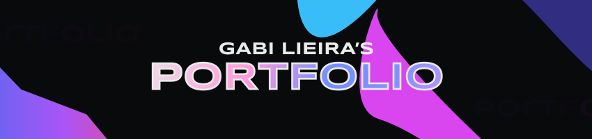

## PORTFÓLIO

Landing Page responsiva desenvolvida em HTML, CSS e JavaScript. Tendo como objetivo apresentar meus principais trabalhos desenvolvidos.

## • Sobre • 
Ao longo da página, você poderá encontrar algumas informações a meu respeito, alguns dos principais projetos que desenvolvi, onde é possível acessar cada um deles e, por fim, meios de contatos caso queira conversar :)
  
Esta é apenas uma primeira versão do portfólio, planejo adicionar cada vez mais conteúdo, principalmente projetos, conforme vou me aperfeiçoando e desenvolvendo mais. 
  
Espero que gostem!

## • Design •
O design para esta landing page foi criado pela minha amiga UX Design, [Talita Aya](https://github.com/talita-aya). As inspirações foram algo minimalista e que remetesse ao tema galáxia, dando destaque aos projetos em exposição.

